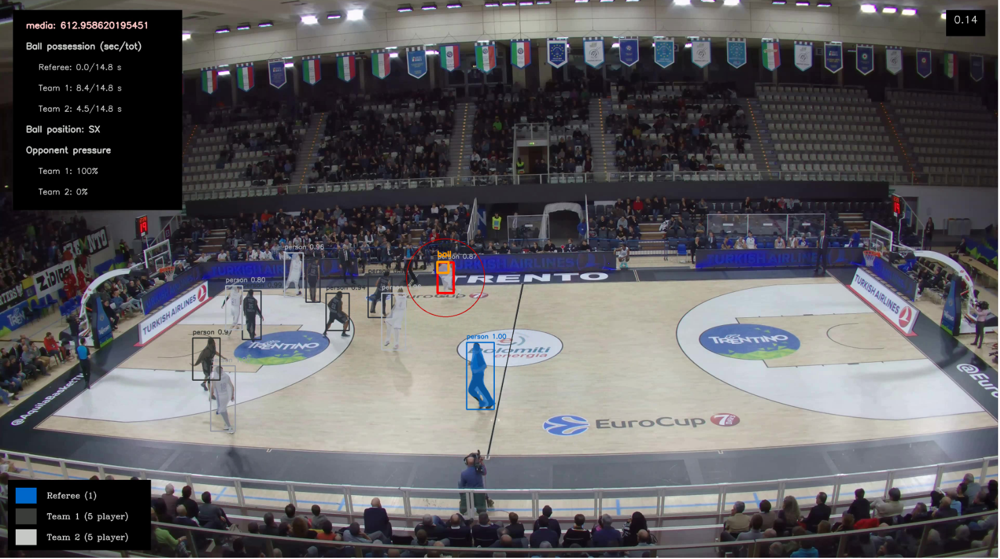
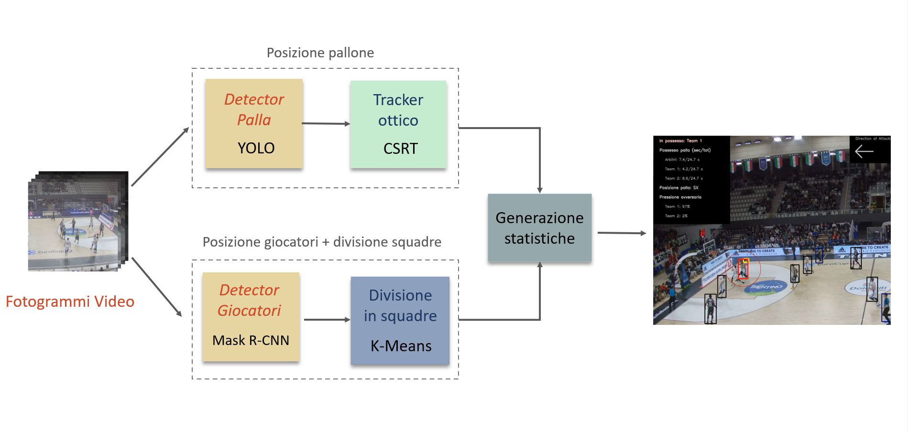

# Automatic statistics generator on basketballs video 

To use this code:
1. Install the maskrcnn requirements (mask_rcnn_UPG_x_playerDetection/requirements.txt    + python setup.py)
2. Install opencv & numpy (per yolo, trackerCSRT)

	NOTE: in the last version of openCV library the tracker CSRT file tracker_parameters.yaml is changed!!!! if there are some problem with this file please remove the lines that use that file in the custom_tracking_v2.py file
	
3. Download the weights files from here__________ and put them in a folder called weights in the directory of the project
4. Download the test video file "prova2" from here__________ and put it in a folder called input_video in the directory of the project
5. use the files run_******.sh to run the different part of the framework

**The framework can be run in separate steps (look at the image on top off this page to understand the main parts of the framework):**

1. **detetection of the ball with yolo** (execute: run_ball_detector.sh)  INPUT: video_file     			OUT: file txt in MOT format with the detection positions, output_video

1. **ball tracking and interpolation** (execute: run_ball_tracker.sh)	INPUT: video_file, detection_txt_file		OUT: file txt with tracking, output_video

2. **players detection**	(execute: run_player_detection-sh)		INPUT: video_file 				OUT: file txt with player divided by teams, output_video

3. **statistics generation**			(run_stats.sh)				INPUT: video, players_det_txt_file, ball_tracking_file	OUT: stats.txt, out_video
